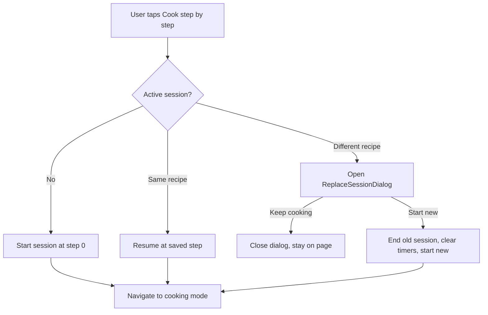

# Healthy Meal Picker — Frontend Spec

Sep 23, 2026 · @Jose

## Overview

Build a frontend-only web app that suggests one healthy, tasty meal at a time and guides the user through cooking it. It is a personal tool: no auth, no backend, all user data on the device.

Design reference: [Healthy Meal Picker canvas](https://claude.ai/artifact/TwYU1irTkqpPqb3quCV533). Screens there are the source of truth for layout, copy and interaction. Recipe text in the canvas is sample content only.

**In scope for this phase**

- Meal picker (breakfast, lunch, dinner) with time filter and "something else" rotation
- Recipe detail
- Step-by-step cooking mode with persistent timers and a global timer bubble
- One active cooking session, with a blocking confirm dialog to replace it
- Favorites, cooking history and ratings
- Week planner with a derived shopping list
- English (default) and Spanish UI and recipe content
- Responsive: phone and desktop are equally important

**Out of scope**

- Auth, accounts, sync, backend or database
- Calorie or macro tracking
- Native mobile apps (a later decision, not this codebase)
- Background timer alerts when the browser is closed or the phone is locked
- Hydration mismatch handling beyond the minimum needed to run (deferred by decision)

## Stack and conventions

Use current stable versions at project start; pin them in `package.json`.

| Concern | Choice |
| --- | --- |
| Framework | Next.js 16, App Router, TypeScript strict |
| Styling | Tailwind CSS v4, tokens in CSS via `@theme` |
| i18n | next-intl, locale-prefixed routes |
| Client state | Zustand with `persist` middleware (localStorage) |
| Data validation | Zod |
| Unit tests | Vitest |
| Component tests | Vitest + React Testing Library |
| Lint / format | ESLint + Prettier |
| Package manager | pnpm |

Conventions:

- No `any`. Types come from Zod schemas via `z.infer` where data is validated.
- Components are function components; props typed inline or with a local `Props` type.
- Server components by default; add `"use client"` only where state, effects or browser APIs are needed.
- File names: `PascalCase.tsx` for components, `camelCase.ts` for everything else.
- No inline hex colors or raw pixel values in components; use theme tokens.
- Every user-facing string goes through next-intl, including `aria-label`s.

## Architecture

Feature-based structure. Route files compose features; features own their UI, state and logic; shared code has no feature knowledge.

```
src/
  app/
    [locale]/
      layout.tsx                  providers, AppShell, <TimerBubble/>
      page.tsx                    picker
      recipes/[id]/page.tsx       recipe detail
      recipes/[id]/cook/page.tsx  cooking mode
      week/page.tsx               planner + shopping list
      saved/page.tsx              favorites + history
      pantry/page.tsx
  features/
    recipes/     types.ts, schema.ts, data/, repository.ts, components/
    picker/      lib/suggest.ts, components/
    cooking/     store.ts, lib/timers.ts, hooks/, components/
    planner/     store.ts, lib/shoppingList.ts, components/
    favorites/   store.ts, components/
    pantry/      store.ts, components/
  shared/
    ui/          Button, Chip, SegmentedControl, Dialog, LanguageSwitch, BottomNav, SideNav
    lib/         storage.ts, cn.ts, format.ts
    hooks/       useNow.ts
  i18n/          routing.ts, request.ts, navigation.ts
  styles/        globals.css (Tailwind + @theme tokens)
messages/        en.json, es.json
```

Rules (enforce with ESLint `no-restricted-imports`, or eslint-plugin-boundaries):

1. `app/**` files are thin: fetch data from repositories, render feature components. No business logic.
2. Each feature exposes a public `index.ts`. Other code imports only from `@/features/<name>`, never from its internals.
3. `shared/**` never imports from `features/**`.
4. Feature-to-feature imports are allowed only through public APIs and must not be circular. Allowed: `picker → recipes`, `cooking → recipes`, `planner → recipes`, `favorites → recipes`.
5. Business logic lives in pure functions under `lib/`, with no React and no store access. Components and hooks call them.
6. Recipe data is read only through `features/recipes/repository.ts`.
7. One source of truth per fact. Derived values (shopping list, remaining time, suggestion list) are computed, never stored.

Path alias: `@/*` → `src/*`.

## Internationalization

English is the default locale; Spanish is optional. Two kinds of translation are kept strictly apart.

| Kind | Where it lives | Example |
| --- | --- | --- |
| UI strings | `messages/en.json`, `messages/es.json` | "Something else", "Step 2 of 5" |
| Recipe content | Localized fields on each recipe record | recipe name, steps, ingredient labels |

Routing and behavior:

- Locales: `en`, `es`. Routes are `/en/...` and `/es/...`; `/` redirects to `/en`.
- `LanguageSwitch` (EN / ES segmented control) swaps the locale segment and keeps the current path.
- The chosen locale is remembered (next-intl cookie). No auto-detection from the browser in this phase.
- Message keys are namespaced by feature: `picker.*`, `cooking.*`, `recipes.*`, `planner.*`, `common.*`.
- Use ICU plurals and interpolation, e.g. `"timers": "{count, plural, one {# timer} other {# timers}}"`.
- A missing Spanish recipe field falls back to English. A missing UI key is a build error (type-safe messages).

Helper: `localize(field: Localized, locale: Locale): string` in `shared/lib/format.ts`, used everywhere recipe text is rendered.

Machine-translated recipe text must be reviewed by a person before it ships, especially quantities and cooking terms.

## Data model

Recipes are a curated, version-controlled set stored as TypeScript data in `features/recipes/data/`, one file per recipe. They are validated with Zod at build/test time.

```ts
type Locale = 'en' | 'es';
type Localized = { en: string; es?: string };

type Meal = 'breakfast' | 'lunch' | 'dinner';
type Effort = 'nocook' | 'easy' | 'medium';

type Recipe = {
  id: string;                 // kebab-case, stable, e.g. 'miso-salmon'
  meals: Meal[];              // a recipe can fit more than one slot
  timeMin: number;            // total active + passive time
  effort: Effort;
  servings: number;
  plate: { veg: boolean; protein: boolean; grain: boolean; fat: boolean };
  tint: string;               // placeholder color token until photos exist
  image?: string;             // path under /public/recipes
  name: Localized;
  flavorNote: Localized;      // "why it tastes good"
  ingredients: Ingredient[];
  steps: Step[];
  source?: { title: string; url: string }; // where the curated recipe came from
};

type Ingredient = {
  id: string;                 // unique within the recipe
  qty: string;                // display string, e.g. '3/4 cup', '2'
  label: Localized;
  shoppingKey: string;        // normalized key for list merging, e.g. 'salmon-fillet'
  aisle: 'produce' | 'protein' | 'dairy' | 'pantry' | 'other';
};

type Step = {
  text: Localized;
  uses: string[];             // ingredient ids shown as chips in cooking mode
  timer?: { durationSec: number; label: Localized };
};
```

Repository (`features/recipes/repository.ts`) is the only access path:

```ts
getAllRecipes(): Recipe[]
getRecipe(id: string): Recipe | undefined
getRecipesByMeal(meal: Meal): Recipe[]
```

It is synchronous now. Keep the call sites isolated so it can become async (API or database) without touching features.

Seed content: 10 to 15 recipes at first, at least 3 per meal, each with EN and ES text and a `source`. The nine sample recipes in the canvas are placeholders, not vetted content.

## Features and screens

Each screen matches its artboard in the canvas. Phone layouts use a bottom nav (Pick, Week, Saved, Pantry); desktop (≥ 1024px) uses a left side nav.

### Picker (`/[locale]`)

- Default meal tab from local time: before 11:00 breakfast, before 16:00 lunch, otherwise dinner.
- Filters: meal tab (3) and max time (Any, 15, 30 min). Filter state is local UI state, not persisted.
- Shows one suggestion card: placeholder image/tint, name, time, effort, four plate chips (filled = present, dashed = absent), flavor note, position ("2 of 5").
- "Something else" advances to the next candidate and wraps around.
- Candidate order from `suggest()` in `picker/lib/suggest.ts`: filter by meal and time, drop recipes cooked in the last 3 days, then sort favorites and higher-rated recipes first, then randomize ties.
- Heart toggles favorite. "Cook this" opens recipe detail.
- Empty state when no recipe matches the filters.

### Recipe detail (`/[locale]/recipes/[id]`)

- Hero image/tint, back button, language switch, title, time · effort · servings, plate chips.
- Primary action "Cook step by step" → runs the start-cooking flow (below).
- "Why it tastes good" card, ingredient checklist (checks are local UI state), numbered steps.
- Footer actions: "Add to week" (opens a day + meal picker) and "I cooked it" (logs history, then asks for a 1–5 rating).

### Cooking mode (`/[locale]/recipes/[id]/cook`)

- Header: exit (back to recipe detail, session stays), "Step n of N", language switch, segmented progress bar.
- Body: large step number, step text (large serif), "You'll need" chips from `step.uses`, timer card if the step has a timer.
- Timer card states: idle (shows duration, Start), running (live countdown, Reset), done ("Time's up", Reset clears it).
- Footer: Back and Next (64px tall). Last step shows Finish, which ends the session and logs history.
- Keeps the screen awake while mounted (see `useWakeLock`).
- If the URL recipe differs from the active session's recipe, run the start-cooking flow instead of rendering.

### Start-cooking flow and replace dialog



Logic lives in `useStartCooking()`; components never branch on session state themselves.

`ReplaceSessionDialog` is built on shared `Dialog`, which wraps the native `<dialog>` element opened with `showModal()`:

- Dimmed backdrop; page behind is inert; focus moves into the dialog and returns to the trigger on close.
- Esc and backdrop click act as "Keep cooking" (the safe choice).
- Title "Start a new recipe?", body names the current recipe, buttons "Keep cooking" (secondary) and "Start new" (destructive, tomato).

### Timer bubble (global)

- Rendered in `[locale]/layout.tsx`, fixed bottom-right, above the bottom nav on phone.
- Shows while a session has at least one timer. In cooking mode it excludes the current step's timer.
- One timer: pill shows label + remaining time; tap navigates to that step in cooking mode.
- Several timers: pill shows "N timers · soonest time"; tap expands a vertical stack sorted by soonest end; tap an item to navigate to its step and collapse.
- Any finished timer turns the pill tomato and shows "Time's up".
- When a timer finishes while the app is visible: play a short sound and call `navigator.vibrate` where supported, once per timer.

### Favorites and history (`/[locale]/saved`)

- Tabs: Saved (favorites) and History (cooked entries, newest first, with rating).
- Rating is 1–5, optional, editable from history.

### Week planner (`/[locale]/week`)

- Grid of 7 days × 3 meals; each slot holds one recipe id or is empty.
- Empty slot → recipe chooser filtered by that meal. Filled slot → open, replace or clear.
- "Fill empty slots" uses `suggest()` and avoids repeating a recipe more than twice a week.
- Shopping list is derived with `buildShoppingList(plan, recipes)`: merge by `shoppingKey`, group by `aisle`. Checked items are stored per week.
- Desktop shows grid + list side by side; phone shows the list as a second tab.

### Pantry (`/[locale]/pantry`)

- Free list of ingredient keys the user has on hand.
- When non-empty, `suggest()` ranks recipes that use more pantry items higher. No screen in the canvas yet; keep it minimal.

## State and persistence

One Zustand store per feature, each persisted to localStorage under its own key with a `version` and a `migrate` function. Stores hold only facts; anything derivable is computed.

| Store | Key | Holds |
| --- | --- | --- |
| cooking | `mp.cooking.v1` | active session or null |
| favorites | `mp.favorites.v1` | favorite ids, history entries, ratings |
| planner | `mp.planner.v1` | week plans, checked shopping items per week |
| pantry | `mp.pantry.v1` | pantry ingredient keys |

Cooking store:

```ts
type CookSession = {
  recipeId: string;
  stepIndex: number;
  startedAt: number;                          // epoch ms
  timers: Record<number, { endsAt: number }>; // key = step index; one timer per step
};

type CookingStore = {
  session: CookSession | null;
  start(recipeId: string): 'started' | 'resumed' | 'needs-confirm';
  replace(recipeId: string): void;   // ends current, starts new
  end(): void;
  goToStep(index: number): void;
  startTimer(step: number, durationSec: number): void;
  clearTimer(step: number): void;
};
```

Timer rules:

- A timer is only its `endsAt` timestamp. Remaining time = `max(0, endsAt - now)`. Never count down with per-timer intervals.
- `shared/hooks/useNow(intervalMs = 1000)` is one shared ticking clock (single interval, subscribed via a tiny store). All countdowns read from it.
- Timers survive step changes, navigation, reloads and closing the tab, because they are persisted timestamps.
- Pure helpers in `cooking/lib/timers.ts`: `remainingSec`, `isDone`, `sortBySoonest`, `formatClock`.
- The current step lives only in the store, not in the URL. The bubble calls `goToStep` then navigates.

Other stores:

```ts
type HistoryEntry = { recipeId: string; cookedAt: number; rating?: 1 | 2 | 3 | 4 | 5 };
type FavoritesState = { favoriteIds: string[]; history: HistoryEntry[] };

type Slot = { day: 0|1|2|3|4|5|6; meal: Meal };
type WeekPlan = { weekStart: string; slots: Record<string, string | null>; checked: string[] }; // slot key 'd-meal', checked = shoppingKeys
```

`shared/lib/storage.ts` wraps localStorage with try/catch. On read failure the app starts with empty state instead of crashing.

## Design system tokens

Define these once in `styles/globals.css` inside `@theme`. Components use only the generated utilities.

| Token | Value | Use |
| --- | --- | --- |
| `--color-ground` | `#F6F2EA` | app background |
| `--color-surface` | `#FFFFFF` | cards, dialogs |
| `--color-sunken` | `#EAE3D6` | segmented controls, icon buttons |
| `--color-nav` | `#FBF8F2` | bottom/side nav |
| `--color-line` | `#E2DACB` | borders, dividers |
| `--color-ink` | `#1F2A1F` | primary text, selected tabs |
| `--color-muted` | `#5E5849` | secondary text |
| `--color-herb` | `#2F6B3F` | primary actions, progress |
| `--color-herb-soft` | `#E3EEDF` | plate chip filled |
| `--color-herb-ink` | `#1F4A2B` | text on herb-soft |
| `--color-tomato` | `#C4512D` | timers, finished state, favorite |
| `--color-tomato-strong` | `#B0431F` | destructive button |
| `--color-warm` | `#FBF3E8` | "why it tastes good" card |
| `--color-warm-ink` | `#9A3F22` | label on warm card |

Type: display = Fraunces (500, 600), body = DM Sans (400, 500, 600), loaded with `next/font/google`. Fallbacks: Georgia for display, system-ui for body.

Shape and sizing: card radius 22px, button radius 14px, chip radius full. Minimum touch target 44 × 44px; cooking-mode buttons 64px tall. Countdown digits use `tabular-nums`.

Accessibility: all text meets WCAG AA contrast on its background; segmented controls use `aria-pressed`; the dialog uses `aria-labelledby`; icon-only buttons have translated `aria-label`s.

## Build phases

Build in order. Each phase ends with lint, type check and tests passing, and is done only when its acceptance checks hold.

1. **Foundation.** Scaffold, tokens in `@theme`, fonts, next-intl routing and messages, shared UI (Button, Chip, SegmentedControl, Dialog, LanguageSwitch, BottomNav, SideNav), app shell.
   - `/` redirects to `/en`; switching to ES keeps the path; every string on screen changes.
   - Dialog blocks the page behind it and closes on Esc.
2. **Recipe data.** Types, Zod schema, repository, 10 to 15 curated recipes with EN/ES text.
   - A test validates every recipe against the schema and checks that `uses` reference real ingredient ids.
3. **Picker.** `suggest()` + screen.
   - Default meal follows local time; filters and "Something else" work; empty state shows.
   - `suggest()` unit tests cover filtering, recent-cook exclusion and ranking.
4. **Recipe detail.**
   - Matches the canvas on phone and desktop; checklist and favorite work.
5. **Cooking.** Store, cooking mode, timers, `useNow`, timer bubble, `useStartCooking`, ReplaceSessionDialog, `useWakeLock`.
   - Start a timer, change steps, reload the page: the timer is still counting correctly.
   - Two timers running: bubble stacks, expands, and each item opens its own step.
   - Starting a different recipe shows the dialog; Keep cooking changes nothing; Start new clears the old session.
   - Screen stays awake in cooking mode on a supported phone browser.
6. **Favorites and history.** Saved screen, "I cooked it", ratings; picker uses them for ranking.
7. **Week planner.** Grid, chooser, fill empty slots, derived shopping list.
   - `buildShoppingList` tests cover merging duplicates and grouping by aisle.
8. **Pantry and PWA.** Pantry list and ranking boost; web app manifest and icons so it installs to the home screen.

## Testing, limitations and open decisions

Testing: every pure function in `lib/` has unit tests. Stores are tested through their actions with a fake clock (`vi.useFakeTimers`). Component tests cover the start-cooking flow, the dialog and the bubble states.

Known limitations (accepted for this phase):

- A timer that ends while the browser is backgrounded or the phone is locked will not alert. The bubble shows it as finished on return.
- Screen wake lock depends on browser support and is released when the tab is hidden; re-request it on `visibilitychange`.
- All data is per device and browser. Clearing site data erases it.
- Hydration mismatches from persisted state are deferred; gate persisted UI behind a mounted check only where it breaks rendering.

Open decisions:

- [ ] Source list for the curated recipes
- [ ] Whether a step can ever need two timers (current model: one timer per step)
- [ ] Timer sound: bundled file or generated tone
- [ ] Export/import of local data as JSON, to survive clearing browser data